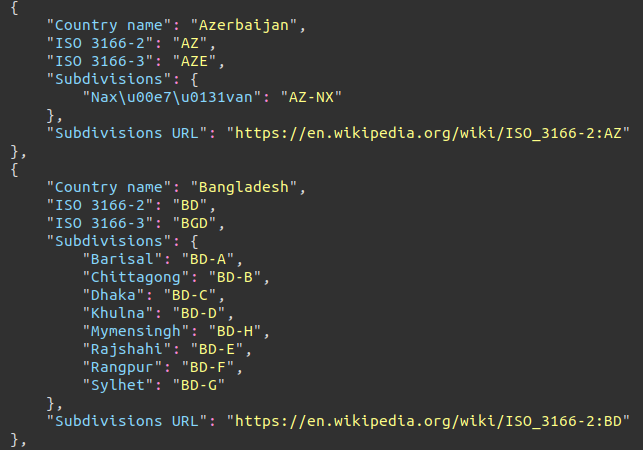

## ISO-3166 Countries with Subdivisions(Regions)

### Overview
A simple web crawler created by use of [Scrapy](https://github.com/scrapy/scrapy). It crawls Wikipedia for all countries list and extracts their name and ISO-3166-1 alpha-2 as well as ISO-3166-1 alpha-3 codes. Moreover it follows each country and extracts it's subdivisions (regions) and their corresponding ISO-3166-2 codes.

All of that is exported into a [JSON file](country_codes.json) as following:

### Requirements
- Python 3.5+
- Scrapy

### Install
- Install Scrapy following [their documentation](https://github.com/scrapy/scrapy)
- Clone this git

### Running
- From the repo directory run `scrapy crawl codes`

*Note* that crawler **will not** overwrite output `country_codes.json` file, but will append to it. Therefore you might want to backup the output file first by renaiming it.

